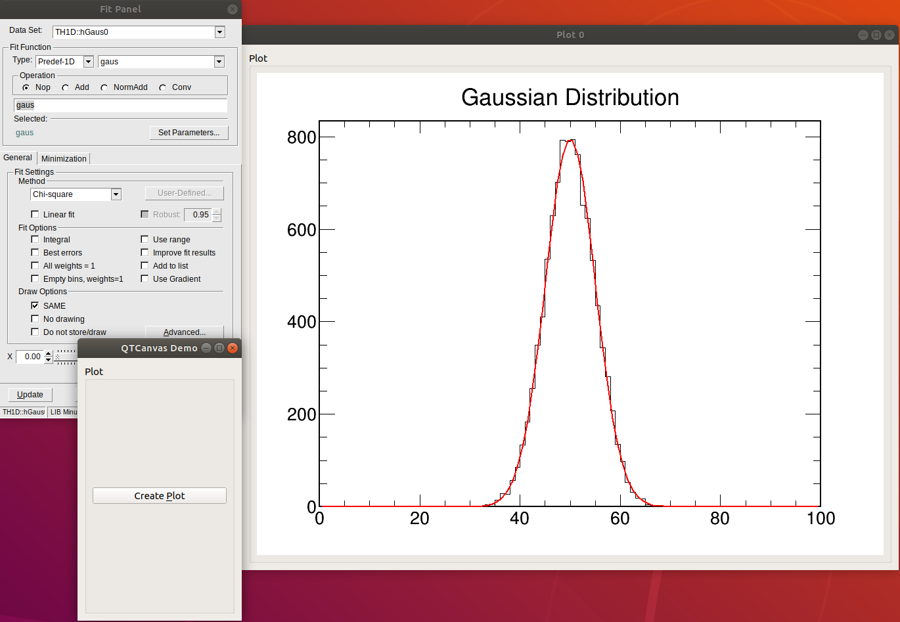

# Qt/ROOT Example #
This is a simple example demonstrating how to embed a ROOT TCanvas inside a
Qt application using a wrapper inheriting from QWidget. This allows the
programmer to combine the ease of creating a GUI application using Qt with
the powerful plotting and analysis functionality of ROOT.

## Dependencies ##
This code is tested with Qt 5.9, ROOT 6.16, and CMake 3.10. It should work
with any version of Qt5 and most versions of ROOT6+.

## How does it work? ##
The QTCanvas class inherits from QWidget and acts as a wrapper around the
TCanvas. Mouse events registered in the Qt event loop are passed through
to the TCanvas and a timer tells the ROOT event loop to update every 20 ms.
The main components that allow this all to work are the QTCanvas
pass-through functions, the QTimer in the MainWindow, and the changeEvent()
override in PlotWindow. 

Here is a screenshot showing the window created when the Create Plot button
is clicked:

## Acknowledgements ##
A few years ago I made a forums post asking how to do this
(https://root-forum.cern.ch/t/qtroot-support-for-qt4/16669/3) and using the
reply to this post, as well as extensive Googling and trial and error, I
was able to put together some code that worked, which I now use for my own
research analysis work. 
Thanks to those who attempted to do this at various points and posted their
code online, allowing me to cobble this together. I hope that by making
this available, others can save some time figuring out how to do this!

## Additional Notes ##
This is not a perfect solution and occasionally there are glitches, such as
having to click on a canvas for it to display. Just gotta deal with it!
